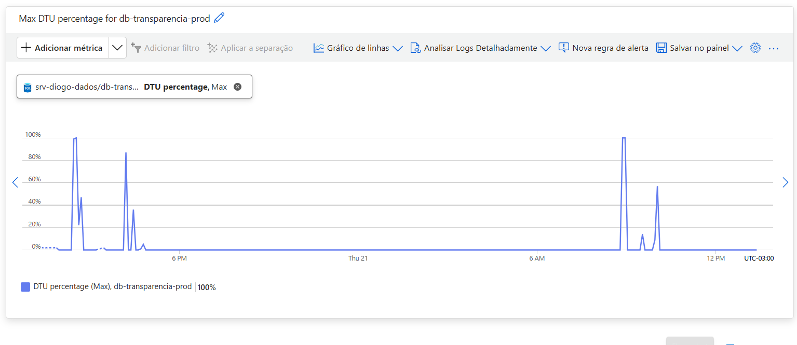

# Performance Tuning e Monitoramento de Dados na Azure SQL

Este repositório documenta um laboratório prático de Engenharia de Dados voltado para a simulação de carga de produção, monitoramento de telemetria de hardware e otimização de consultas (Performance Tuning) em um ambiente cloud utilizando **Azure SQL Server**, **Azure Logic Apps** e **SQL Server Management Studio (SSMS)**.

## 🎯 O Desafio de Negócio & Infraestrutura
O objetivo foi estruturar uma pipeline de dados automatizada e resiliente sob uma restrição severa de custos e hardware. O banco de dados foi configurado na camada **Basic (DTU)** da Azure, que possui um teto computacional baixo (5 DTUs), tornando-o o cenário perfeito para identificar gargalos e aplicar técnicas de otimização sem a necessidade de upgrade de hardware (escalabilidade vertical dispendiosa).

---

## 🏗️ Etapas do Processo

### 1. Ingestão e Carga de Dados em Massa (Volume)
Para simular um cenário real de alta volumetria, foi desenvolvida uma estrutura de dados de vendas (`Vendas_Performance`). Utilizando um laço de repetição (`WHILE`) no SSMS, realizamos a carga rápida de **50.000 registros** estruturados para servir de massa de teste.

### 2. Automação e Agendamento (Serverless)
Configuramos uma esteira de execução automatizada através do **Azure Logic Apps (Plano de Consumo)**. O robô foi programado com um gatilho de recorrência temporal para disparar a consulta analítica a cada 12 horas, simulando rotinas de fechamento ou atualização de relatórios gerenciais na empresa.

### 3. A Consulta Cenário (Gargalo Técnico)
A query agendada foi desenhada de propósito com padrões ineficientes de busca — utilizando funções agregadas densas (`SUM`, `AVG`), subconsultas aninhadas e operadores de texto pesados (`LIKE '%...%'`) —, forçando o motor de busca do SQL Server a realizar um *Table Scan* completo nas 50.000 linhas.

```sql
SELECT 
    v.categoria,
    SUM(v.valor) AS total_vendido,
    AVG(v.valor) AS media_valor,
    (SELECT COUNT(*) FROM Vendas_Performance sub WHERE sub.categoria = v.categoria AND sub.produto LIKE '%Dell%') AS produtos_especiais
FROM Vendas_Performance v
WHERE v.produto LIKE '%LG%' OR v.produto LIKE '%Dell%'
GROUP BY v.categoria;
```

📊 Monitoramento de Telemetria (Resultados Antes do Tuning)
Através do painel de Métricas e da ferramenta Query Performance Insight no portal da Azure, isolamos o comportamento do banco durante a execução do robô:

Gargalo de Hardware: O consumo de processamento atingiu 100% de utilização de DTU/CPU.

Sintoma: O banco de dados ficava temporariamente indisponível/lento para outras requisições devido ao esforço para varrer a tabela sequencialmente.

🛠️ A Solução: Performance Tuning (Otimização)
Para mitigar o uso de hardware e derrubar o tempo de resposta, foi desenhada uma estratégia de indexação. Criamos um Índice Não-Clusterizado (Non-Clustered Index) cobrindo as colunas de filtro (produto e categoria) e incluindo a coluna de cálculo (valor), funcionando como um sumário remissivo para o motor do banco.

SQL
CREATE INDEX idx_vendas_produto_categoria 
ON Vendas_Performance (produto, categoria) 
INCLUDE (valor);
🚀 Resultados Finais e Impacto
Após a aplicação do índice, forçamos um novo disparo da esteira e os gráficos de telemetria comprovaram o sucesso do tuning:

Consumo de Hardware: O pico de utilização de DTU despencou de 100% para próximo de 0%.

Tempo de Resposta: A execução da consulta passou de segundos para poucos milissegundos.

Eficiência de Custo (FinOps): Provamos que com a otimização de queries é possível manter uma aplicação performática em camadas de computação baratas, gerando economia direta de infraestrutura para o negócio.

Tecnologias Utilizadas: Azure SQL Database, Azure Logic Apps, SQL Server Management Studio (SSMS), T-SQL, Cloud Telemetry & Metrics.


---

```markdown
### 📈 Gráfico de Telemetria (Picos de 100% antes do Índice)

